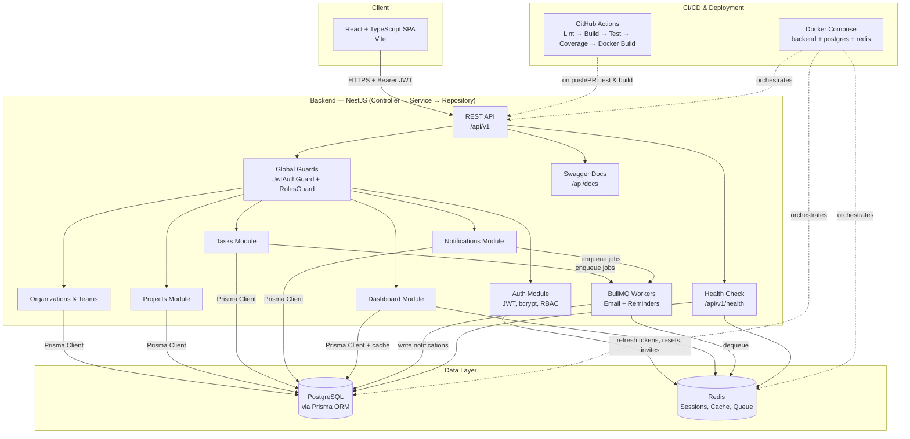
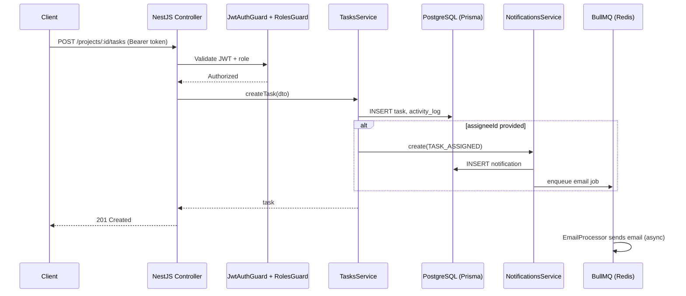

# Enterprise Project & Task Management Platform

Production-grade full-stack platform for managing organizations, teams, projects, tasks,
roles, notifications, and activity tracking. Built with NestJS, PostgreSQL, Redis, and React.

## Screenshots

See [docs/screenshots](./docs/screenshots) for a full walkthrough — login, registration,
project creation, and the Kanban task board in action.

## Tech Stack

| Layer              | Technology                                  |
|--------------------|----------------------------------------------|
| Backend            | NestJS + TypeScript                          |
| Database           | PostgreSQL (Prisma ORM)                      |
| Cache / Queue      | Redis + BullMQ (background jobs)             |
| Frontend           | React + TypeScript (Vite)                    |
| Auth               | JWT (access + refresh tokens), RBAC          |
| API Docs           | Swagger / OpenAPI (`/api/docs`)              |
| Testing            | Jest + Supertest (unit + E2E)                |
| Containerization   | Docker / Docker Compose                      |
| CI/CD              | GitHub Actions                               |

## Architecture



### Request Flow Example — Creating a Task



See [docs/architecture.md](./docs/architecture.md) and [docs/er-diagram.md](./docs/er-diagram.md)
for the deployment topology diagram and the full entity-relationship diagram.

## Project Structure

```
enterprise-pm-platform/
├── backend/ # NestJS API
│ ├── src/
│ │ ├── auth/ # Register, login, JWT strategy, guards, RBAC decorators
│ │ │ ├── dto/ # Request validation (register, login, reset-password, etc.)
│ │ │ ├── guards/ # JwtAuthGuard, RolesGuard
│ │ │ ├── strategies/ # Passport JWT strategy
│ │ │ └── decorators/ # @Public(), @Roles(), @CurrentUser()
│ │ ├── organizations/ # Org details, invite users, roles, activate/deactivate
│ │ ├── teams/ # Team CRUD, membership
│ │ ├── projects/ # Project CRUD, computed progress, optimistic locking
│ │ ├── tasks/ # Task CRUD, subtasks, dependencies, comments
│ │ ├── notifications/ # In-app notifications + BullMQ processors
│ │ │ └── processors/ # EmailProcessor, NotificationsProcessor (background jobs)
│ │ ├── dashboard/ # Analytics endpoints (Redis-cached)
│ │ ├── health/ # /api/v1/health (DB + Redis checks)
│ │ ├── prisma/ # PrismaService (global DB client)
│ │ ├── redis/ # RedisService (global cache/queue client)
│ │ ├── app.module.ts # Root module — wires all feature modules + global guards
│ │ └── main.ts # Bootstrap, ValidationPipe, Swagger, API prefix
│ ├── prisma/
│ │ ├── schema.prisma # 14-model relational schema (source of truth for DB)
│ │ └── migrations/ # Versioned SQL migrations
│ ├── test/ # E2E tests (app.e2e-spec.ts, auth.e2e-spec.ts)
│ ├── Dockerfile # Multi-stage build (builder + production)
│ ├── jest.config.ts # Unit test config
│ └── package.json
│
├── frontend/ # React + TypeScript SPA (Vite)
│ ├── src/
│ │ ├── api/client.ts # Axios instance, auth header + token-refresh interceptor
│ │ ├── context/AuthContext.tsx # Login/register/logout state, localStorage persistence
│ │ ├── components/
│ │ │ ├── Layout.tsx # Sidebar navigation + user info
│ │ │ └── ProtectedRoute.tsx # Redirects unauthenticated users to /login
│ │ ├── pages/
│ │ │ ├── Login.tsx / Register.tsx
│ │ │ ├── Dashboard.tsx # Stats cards + Recharts (status/priority breakdown)
│ │ │ ├── Projects.tsx # Project grid + create-project modal
│ │ │ └── ProjectDetail.tsx # Kanban board (To Do / In Progress / Completed)
│ │ ├── types/index.ts # Shared TypeScript interfaces (User, Project, Task)
│ │ └── App.tsx # Router setup
│ └── package.json
│
├── docker/
│ └── docker-compose.yml # postgres + redis + backend, one command to run everything
│
├── docs/
│ ├── er-diagram.md # Full entity-relationship diagram (Mermaid)
│ ├── architecture.md # System + deployment diagrams, design decisions
│ ├── security.md # Auth, RBAC, validation, secrets — security posture
│ ├── test-report.md # Test coverage summary by module
│ ├── postman_collection.json # Importable Postman collection (all endpoints)
│ └── screenshots/ # App walkthrough screenshots
│
└── .github/
└── workflows/ci.yml # Lint, build, unit tests, E2E tests, coverage, Docker build
```

## Features

- **Auth & RBAC**: register, login, JWT refresh-token rotation (Redis-backed), logout,
  forgot/reset password, email verification, role-based access (Admin/Manager/Developer/Viewer)
- **Organizations & Teams**: invite users, manage roles, activate/deactivate users, team membership
- **Projects**: CRUD, status tracking, computed progress (derived from task completion), optimistic locking
- **Tasks**: CRUD, subtasks, dependencies (with completion blocking), comments, priority/status,
  tags, due dates, activity log
- **Notifications**: in-app notifications + background email jobs via BullMQ (task assignment,
  comments, due-date reminders)
- **Dashboard & Analytics**: project/task totals, overdue tasks, tasks by status/priority,
  user workload, completion trends — Redis-cached
- **Search, Filter, Pagination**: server-side across projects and tasks
- **Security**: bcrypt password hashing, centralized validation, CORS, environment-based secrets
- **Testing**: 50+ unit tests, 8+ E2E tests covering auth, RBAC, and core business logic
- **DevOps**: multi-stage Docker build, health-check endpoint (`/api/v1/health`), CI pipeline
  that runs lint, build, unit tests, E2E tests, coverage, and a Docker build check on every push

## Getting Started (Local Development)

### Prerequisites
- Node.js 20+
- Docker & Docker Compose

### 1. Clone and install

```bash
git clone https://github.com/sonujha78/enterprise-pm-platform.git
cd enterprise-pm-platform
```

### 2. Start Postgres + Redis (and optionally the backend) via Docker

```bash
cd docker
docker compose up -d
```

This starts PostgreSQL (`localhost:5432`), Redis (`localhost:6379`), and the backend API
(`localhost:3000`) if you use `docker compose up -d --build`.

### 3. Run the backend locally (alternative to the Docker backend service)

```bash
cd backend
cp .env.example .env
npm install
npx prisma migrate deploy
npm run start
```

API available at `http://localhost:3000/api/v1`.
Swagger docs at `http://localhost:3000/api/docs`.
Health check at `http://localhost:3000/api/v1/health`.

### 4. Run the frontend

```bash
cd frontend
npm install
npm run dev
```

App available at `http://localhost:5173`.

### 5. Run tests

```bash
cd backend
npm test          # unit tests
npm run test:e2e  # end-to-end tests
npm run test:cov  # coverage report
```

## Documentation

- [ER Diagram](./docs/er-diagram.md)
- [Architecture Diagram](./docs/architecture.md)
- [Security Notes](./docs/security.md)
- [Test Report](./docs/test-report.md)
- [Postman Collection](./docs/postman_collection.json)

## Status

✅ Production-ready backend, frontend, tests, Docker, and CI/CD — see commit history for build stages.
