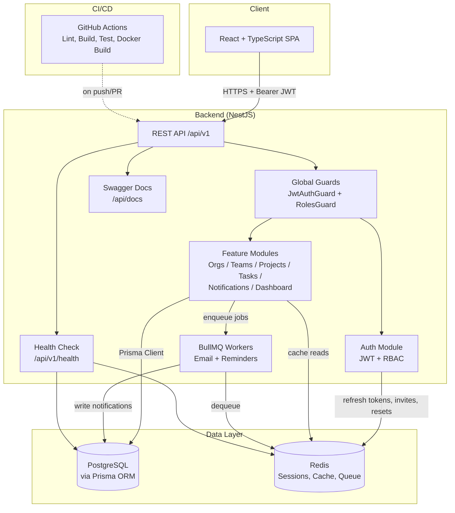
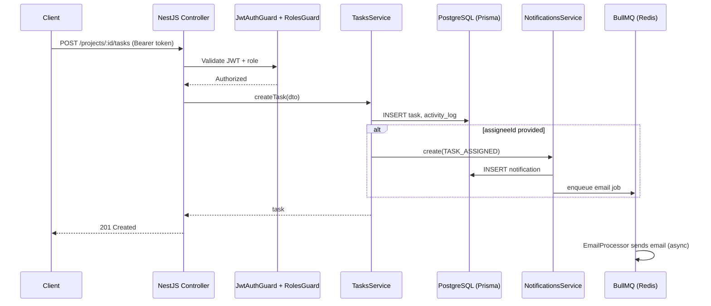
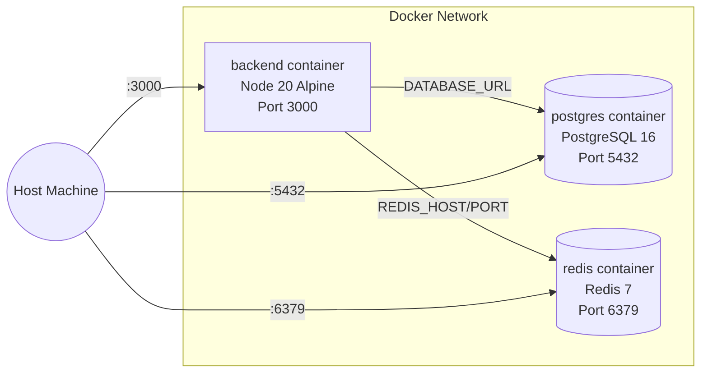

# System Architecture

## High-Level Overview

## Request Flow (Example: Creating a Task)

## Deployment Topology (Docker Compose)

## Key Design Decisions

- **Controller → Service → Repository (Prisma)** layering throughout, per assignment
  Backend Engineering Standards.
- **PostgreSQL** for all relational, transactional data (users, orgs, teams, projects, tasks).
- **Redis** serves three purposes: refresh-token/session store, dashboard analytics cache
  (60s TTL), and the BullMQ job queue backend.
- **Global guards** (`JwtAuthGuard`, `RolesGuard`) protect every route by default; routes are
  opted out explicitly with `@Public()`.
- **Optimistic locking** via a `version` field on `Project` and `Task` prevents lost updates
  when two users edit the same record concurrently.
- **Computed progress** (`completed / total` tasks) is calculated on read, never persisted,
  to avoid data-consistency drift.
- **Background jobs** (email sending, due-date reminders) run through BullMQ instead of the
  request thread, keeping API responses fast.
