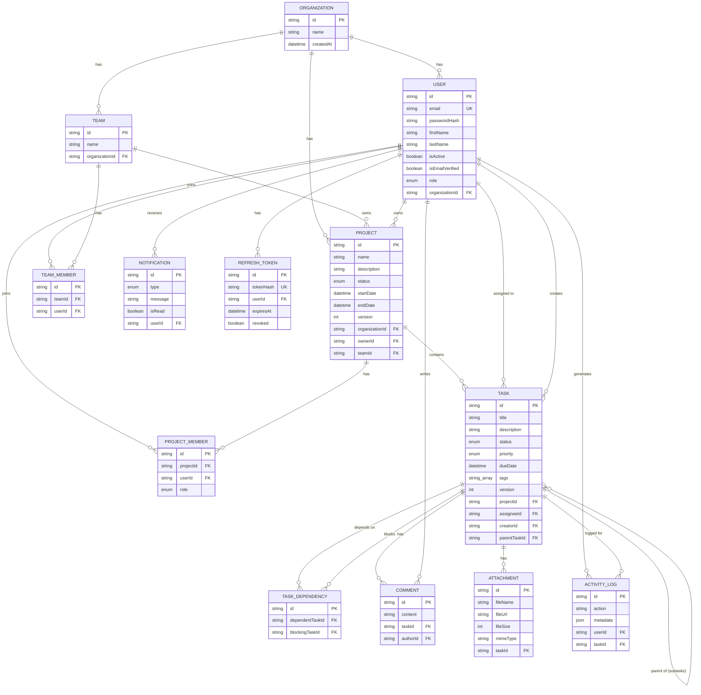

# Entity-Relationship Diagram

```mermaid
erDiagram
    ORGANIZATION ||--o{ USER : has
    ORGANIZATION ||--o{ TEAM : has
    ORGANIZATION ||--o{ PROJECT : has

    USER ||--o{ TEAM_MEMBER : joins
    TEAM ||--o{ TEAM_MEMBER : has
    TEAM ||--o{ PROJECT : owns

    USER ||--o{ PROJECT_MEMBER : joins
    PROJECT ||--o{ PROJECT_MEMBER : has
    USER ||--o{ PROJECT : owns

    PROJECT ||--o{ TASK : contains
    USER ||--o{ TASK : "assigned to"
    USER ||--o{ TASK : creates

    TASK ||--o{ TASK : "parent of (subtasks)"
    TASK ||--o{ TASK_DEPENDENCY : "depends on"
    TASK ||--o{ TASK_DEPENDENCY : "blocks"

    TASK ||--o{ COMMENT : has
    USER ||--o{ COMMENT : writes

    TASK ||--o{ ATTACHMENT : has

    USER ||--o{ NOTIFICATION : receives
    USER ||--o{ ACTIVITY_LOG : generates
    TASK ||--o{ ACTIVITY_LOG : "logged for"

    USER ||--o{ REFRESH_TOKEN : has

    ORGANIZATION {
        string id PK
        string name
        datetime createdAt
    }

    USER {
        string id PK
        string email UK
        string passwordHash
        string firstName
        string lastName
        boolean isActive
        boolean isEmailVerified
        enum role
        string organizationId FK
    }

    TEAM {
        string id PK
        string name
        string organizationId FK
    }

    TEAM_MEMBER {
        string id PK
        string teamId FK
        string userId FK
    }

    PROJECT {
        string id PK
        string name
        string description
        enum status
        datetime startDate
        datetime endDate
        int version
        string organizationId FK
        string ownerId FK
        string teamId FK
    }

    PROJECT_MEMBER {
        string id PK
        string projectId FK
        string userId FK
        enum role
    }

    TASK {
        string id PK
        string title
        string description
        enum status
        enum priority
        datetime dueDate
        string_array tags
        int version
        string projectId FK
        string assigneeId FK
        string creatorId FK
        string parentTaskId FK
    }

    TASK_DEPENDENCY {
        string id PK
        string dependentTaskId FK
        string blockingTaskId FK
    }

    COMMENT {
        string id PK
        string content
        string taskId FK
        string authorId FK
    }

    ATTACHMENT {
        string id PK
        string fileName
        string fileUrl
        int fileSize
        string mimeType
        string taskId FK
    }

    NOTIFICATION {
        string id PK
        enum type
        string message
        boolean isRead
        string userId FK
    }

    ACTIVITY_LOG {
        string id PK
        string action
        json metadata
        string userId FK
        string taskId FK
    }

    REFRESH_TOKEN {
        string id PK
        string tokenHash UK
        string userId FK
        datetime expiresAt
        boolean revoked
    }
```

This diagram mirrors the 14-table schema in `backend/prisma/schema.prisma`, applied via
Prisma migrations (see `backend/prisma/migrations`).
